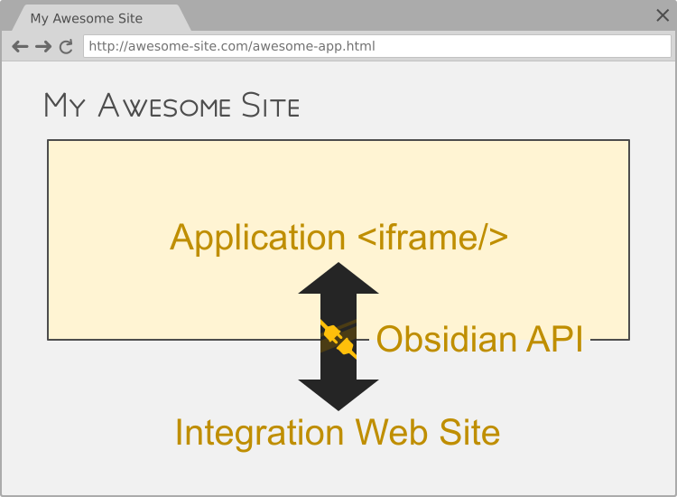

**Obsidian API** is a library that allows you to implement an API between a web
application running in an `iframe` and the web page that integrates it.

**Obsidian API is composed of two parts:**

* An application-side Class (inside the `iframe`) that will be used to
  implement the API (methods that will be called remotely by the
  integration,...),
* and an integration-side script (outside the `iframe`) that will be used as
  a client for the API. This script is completely generic and can be used to
  connect to any web application that implements an Obsidian API.

**Features:**

* Remote method calls with return value (integration → app → integration),
* Provides callback-based events (app → integration),
* Allows the integration to send some configuration to the application before
  it is loaded,
* Allows to transfer various types of objects (including `TypedArrays`,
  `Blob` and `Buffer`),
* Allows to use both node-like callbacks or promises for asynchronous calls.

